### 1. Пошук прихованої сторінки Score Board

На першому етапі необхідно було знайти приховану сторінку **Score Board**, на якій відображається перелік завдань OWASP Juice Shop та стан їх виконання.

Посилання на цю сторінку відсутнє в основному меню застосунку. Для переходу було використано прямий маршрут:

```text
http://localhost:3000/#/score-board
```

Після відкриття адреси Juice Shop відобразив дошку результатів і повідомлення:

```text
You successfully solved a challenge: Score Board
```

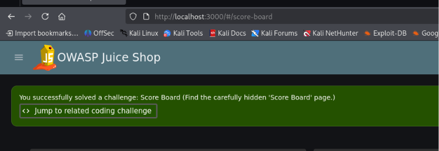


Наявність прихованого маршруту демонструє, що приховування посилання в інтерфейсі не є механізмом захисту. Якщо маршрут присутній у клієнтському JavaScript-коді або конфігурації маршрутизації, його можна знайти за допомогою інструментів розробника чи прямого перебору можливих адрес.

Після виконання основного завдання було відкрито пов’язане завдання **Fix It**, у якому необхідно було визначити правильний спосіб усунення проблеми.

Було встановлено, що маршрут `score-board` повинен залишатися без змін, оскільки сама сторінка є необхідною частиною навчального застосунку. Просте перейменування або додаткове приховування маршруту не забезпечує належного контролю доступу.

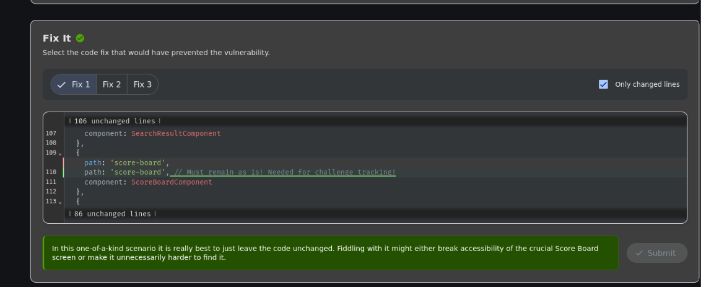


Отже, для захисту технічних або адміністративних сторінок необхідно застосовувати серверну перевірку автентифікації та авторизації, а не покладатися лише на відсутність посилання в інтерфейсі.

### 2. Виконання DOM XSS через пошуковий рядок

На другому етапі було виконано завдання **DOM XSS**. Цей тип міжсайтового виконання сценаріїв виникає, коли клієнтський JavaScript обробляє введені користувачем дані та небезпечно додає їх до структури вебсторінки.

На сторінці Score Board було знайдено опис завдання, відповідно до якого потрібно було вставити в пошуковий рядок HTML-елемент `iframe` із JavaScript-кодом.

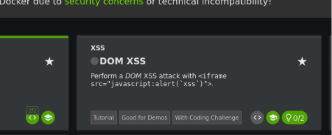


У поле пошуку було введено такий payload:

```html
<iframe src="javascript:alert(`xss`)">
```

У цій конструкції:

- `<iframe>` створює вбудований елемент сторінки;
- атрибут `src` визначає джерело його вмісту;
- схема `javascript:` примушує браузер виконати JavaScript-код;
- функція `alert()` демонструє можливість виконання довільного сценарію.

Після введення payload Juice Shop обробив його як HTML-код, а не як звичайний текст. У результаті завдання було успішно виконано, що підтверджується повідомленням:

```text
You successfully solved a challenge: DOM XSS
```

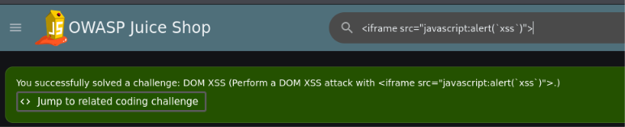


Причиною вразливості є небезпечне додавання введених даних до DOM-структури сторінки без належного очищення. Для запобігання DOM XSS необхідно використовувати безпечні методи виведення тексту, виконувати контекстне кодування та не передавати введені користувачем значення до небезпечних DOM-функцій.

### 3. Виконання додаткового завдання Bonus Payload

Після проходження DOM XSS було виконано додаткове завдання **Bonus Payload**. Його метою було продемонструвати, що через ту саму вразливість можна вставити не лише простий виклик `alert()`, але й складніший зовнішній вміст.

У картці завдання було наведено payload на основі елемента `iframe`, який завантажував вбудований медіаплеєр SoundCloud.

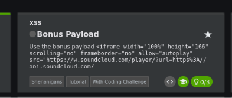


Payload мав загальну структуру:

```html
<iframe
  width="100%"
  height="166"
  scrolling="no"
  frameborder="no"
  allow="autoplay"
  src="https://www.soundcloud.com/player/...">
</iframe>
```

Значення було введено до пошукового рядка Juice Shop. Через відсутність належного очищення введення застосунок інтерпретував його як HTML-розмітку та створив на сторінці вбудований зовнішній елемент.

Після обробки payload було отримано повідомлення:

```text
You successfully solved a challenge: Bonus Payload
```

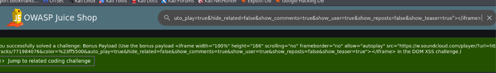


Отриманий результат показує, що наслідки DOM XSS не обмежуються відображенням повідомлень. Вразливість може бути використана для вставлення зовнішнього вмісту, створення підроблених форм, перенаправлення користувача або виконання іншого JavaScript-коду в контексті вразливого вебзастосунку.

### 4. Пошук прихованих директорій за допомогою Gobuster

Для виявлення прихованих каталогів і ресурсів OWASP Juice Shop було використано інструмент **Gobuster**. Він виконує автоматизований перебір можливих шляхів вебзастосунку на основі словника.

Під час першого запуску було встановлено, що Juice Shop повертає відповідь зі статусом `200 OK` навіть для деяких неіснуючих адрес. Такі відповіді мали однакову довжину — `9903` байти, через що Gobuster не міг правильно відрізнити знайдені ресурси від помилкових результатів.

Для виключення таких відповідей було використано параметр:

```text
--exclude-length 9903
```

Повна команда мала такий вигляд:

```bash
sudo gobuster dir \
  -u http://127.0.0.1:3000/ \
  -w /usr/share/wordlists/dirbuster/directory-list-2.3-medium.txt \
  --exclude-length 9903
```

У команді:

- `dir` визначає режим пошуку вебкаталогів;
- `-u` задає адресу досліджуваного вебзастосунку;
- `-w` указує шлях до словника;
- `--exclude-length 9903` виключає типові помилкові відповіді однакового розміру.

Після запуску Gobuster було виявлено декілька доступних ресурсів:

```text
/media
/profile
/video
/assets
/redirect
/ftp
```

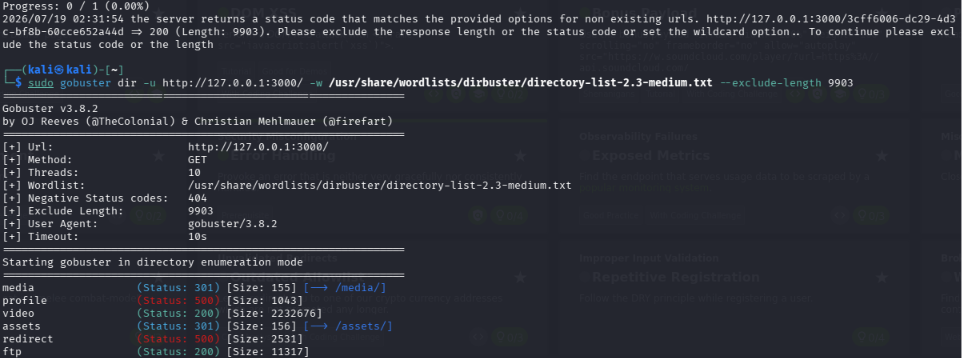


Під час автоматизованого перебору застосунок також повернув некоректно оброблену помилку. У результаті було зараховано завдання **Error Handling**, метою якого є виклик помилки, що обробляється вебзастосунком непослідовно або недостатньо коректно.

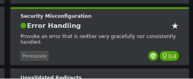


Отриманий результат показує, що автоматизований пошук шляхів дає змогу виявляти ресурси, посилання на які відсутні в основному інтерфейсі. Водночас детальні або неправильно сформовані повідомлення про помилки можуть розкривати інформацію про внутрішню структуру застосунку.

### 5. Виявлення відкритої директорії FTP

Серед результатів сканування Gobuster було виявлено каталог:

```text
/ftp
```

Після переходу за адресою:

```text
http://localhost:3000/ftp
```

сервер відобразив список файлів і підкаталогів:

```text
quarantine/
acquisitions.md
announcement_encrypted.md
coupons_2013.md.bak
eastere.gg
encrypt.pyc
incident-support.kdbx
legal.md
package-lock.json.bak
package.json.bak
suspicious_errors.yml
```

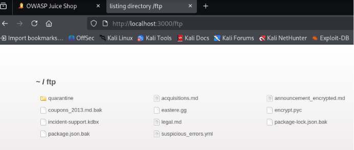


Наявність відкритого списку файлів є небезпечним налаштуванням вебсервера. Користувач може дізнатися назви внутрішніх документів, резервних копій, конфігураційних файлів та інших ресурсів, які не повинні бути загальнодоступними.

Особливу увагу було звернено на файл:

```text
coupons_2013.md.bak
```

Розширення `.bak` зазвичай використовується для резервних копій. Такі файли можуть містити старі версії документів, конфіденційні дані, фрагменти вихідного коду або службову інформацію.

У прикладі виконання завдання також передбачено пошук відкритої директорії `/ftp` і подальшу спробу отримання резервного файла. :contentReference[oaicite:0]{index=0}

### 6. Отримання резервної копії Forgotten Sales Backup

Під час спроби звичайного завантаження файла:

```text
coupons_2013.md.bak
```

сервер застосовував перевірку дозволених розширень. Для обходу цього обмеження до адреси файла було додано спеціально сформований фрагмент:

```text
%2500.md
```

У результаті було сформовано адресу:

```text
http://localhost:3000/ftp/coupons_2013.md.bak%2500.md
```

Послідовність `%25` є URL-кодованим символом `%`. Після повторного декодування фрагмент `%2500` може перетворитися на `%00`, тобто подання нульового байта. Додавання дозволеного розширення `.md` змусило перевірку файла сприйняти адресу як допустиму, тоді як сервер обробив шлях до резервної копії.

Після переходу за сформованою адресою файл було успішно завантажено.

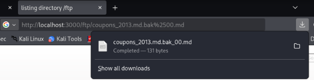


Після виконання цієї дії на Score Board було зараховано завдання:

```text
Forgotten Sales Backup
```

Його метою було отримання забутої резервної копії файла продавця.

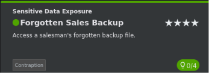


Отриманий результат демонструє ризик зберігання резервних копій у загальнодоступних каталогах. Навіть якщо сервер намагається обмежувати завантаження за розширенням, неправильна обробка URL-кодування може дозволити обійти таку перевірку.

Для захисту необхідно:

- зберігати резервні копії поза кореневим каталогом вебсервера;
- вимикати відображення списку файлів у каталогах;
- перевіряти реальний шлях і тип файла після повного декодування URL;
- використовувати серверний список дозволених ресурсів замість перевірки лише розширення файла.

У прикладі викладача для отримання заблокованої резервної копії також використовується додавання `%2500.md` до назви файла. :contentReference[oaicite:1]{index=1}

### 7. Обхід автентифікації адміністратора за допомогою SQL-ін’єкції

На наступному етапі необхідно було виконати вхід до облікового запису адміністратора без знання його пароля. Для цього було досліджено форму автентифікації OWASP Juice Shop.

Якщо застосунок створює SQL-запит шляхом безпосереднього об’єднання введених користувачем значень, запит може мати приблизно такий вигляд:

```sql
SELECT *
FROM Users
WHERE email = 'введена_адреса'
  AND password = 'введений_пароль';
```

За відсутності параметризованих запитів введені дані можуть змінити логіку оператора `WHERE`.

У поле **Email** було введено SQL-конструкцію:

```sql
' or '1'='1' --
```

У поле **Password** було введено довільне значення, оскільки його перевірка мала бути виключена з SQL-запиту.

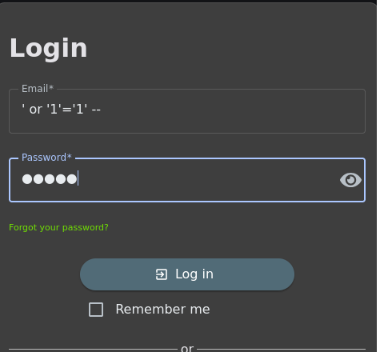


Після підстановки введеного значення запит набув приблизно такого вигляду:

```sql
SELECT *
FROM Users
WHERE email = ''
   OR '1'='1' --'
  AND password = 'довільний_пароль';
```

У цій конструкції:

- перша одинарна лапка завершує значення поля `email`;
- оператор `OR` додає альтернативну умову;
- вираз `'1'='1'` завжди повертає істинне значення;
- символи `--` коментують залишок SQL-запиту, включно з перевіркою пароля.

У результаті умова автентифікації стала істинною. Застосунок повернув перший відповідний запис із таблиці користувачів, яким виявився обліковий запис адміністратора:

```text
admin@juice-sh.op
```

Успішний вхід було підтверджено появою адреси адміністратора в меню облікового запису.

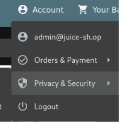

На сторінці Score Board завдання **Login Admin** було позначено як виконане.

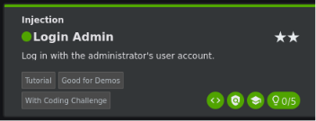


Отриманий результат демонструє обхід механізму автентифікації через SQL-ін’єкцію. Причиною вразливості є небезпечне формування SQL-запиту з введених користувачем значень без належної параметризації.

Для запобігання такій атаці необхідно використовувати підготовлені параметризовані запити, виконувати перевірку вхідних даних і зберігати паролі лише у вигляді криптографічно захищених хешів.

### 8. Отримання доступу до адміністративної панелі

Після входу до облікового запису адміністратора було виконано перехід до прихованого розділу керування OWASP Juice Shop.

Для цього в адресному рядку браузера було відкрито маршрут:

```text
http://localhost:3000/#/administration
```

Після переходу застосунок відобразив сторінку **Administration**, на якій містився список зареєстрованих користувачів та інші адміністративні елементи керування.

Також було отримано повідомлення:

```text
You successfully solved a challenge: Admin Section
```

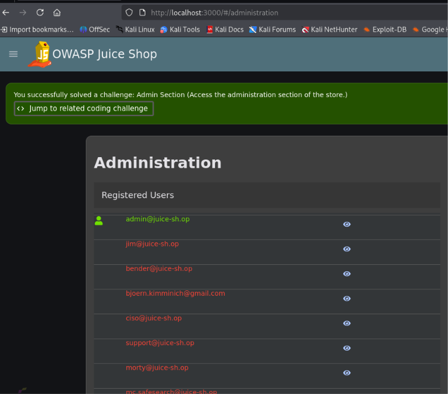


У результаті було встановлено, що адміністративний розділ доступний за передбачуваним маршрутом:

```text
#/administration
```

Саме приховування цього маршруту в інтерфейсі не є достатнім механізмом безпеки. Доступ до адміністративної сторінки повинен контролюватися сервером шляхом перевірки автентифікації та ролі користувача.

У цьому випадку доступ став можливим після входу до облікового запису `admin@juice-sh.op`, отриманого на попередньому етапі за допомогою SQL-ін’єкції.

### 9. Надсилання відгуку з нульовим рейтингом

На наступному етапі необхідно було надіслати відгук із рейтингом `0`, хоча інтерфейс OWASP Juice Shop дозволяв установити лише значення від `1` до `5`.

Це завдання демонструє ненадійність перевірок, які виконуються виключно на стороні клієнта. HTML-атрибути та JavaScript-обмеження можуть бути змінені користувачем через інструменти розробника браузера.

Спочатку у вкладці **Elements** було знайдено HTML-елемент повзунка рейтингу:

```html
<input
  type="range"
  min="1"
  max="5"
  step="1">
```

Мінімальне допустиме значення було змінено з `1` на `0`:

```html
<input
  type="range"
  min="0"
  max="5"
  step="1">
```

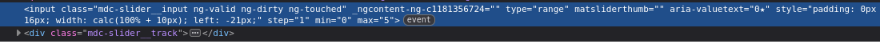


Після внесення змін у формі відгуку з’явилася можливість установити нульовий рейтинг. Також було введено правильну відповідь на CAPTCHA:

```text
10 + 7 - 9 = 8
```

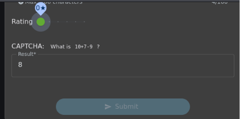


Незважаючи на зміну рейтингу, кнопка **Submit** залишалася неактивною. У її HTML-коді були присутні атрибут і CSS-клас, які блокували натискання:

```html
disabled
```

```text
mat-mdc-button-disabled
```

Атрибут `disabled` було повністю видалено. Також із переліку класів кнопки було вилучено:

```text
mat-mdc-button-disabled
```

Після цього кнопка **Submit** стала доступною для натискання.

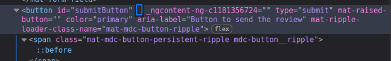


Після надсилання форми OWASP Juice Shop прийняв відгук із нульовою оцінкою та відобразив повідомлення:

```text
You successfully solved a challenge: Zero Stars
```

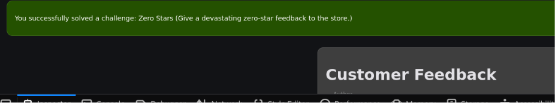


Отриманий результат показує, що клієнтські обмеження не повинні використовуватися як єдиний механізм перевірки даних. Користувач може змінити HTML-код сторінки, видалити атрибути або класи та надіслати значення, які не передбачені інтерфейсом.

Для запобігання таким діям сервер повинен самостійно перевіряти, чи входить рейтинг у дозволений діапазон, незалежно від налаштувань елементів вебсторінки.

### 10. Реєстрація користувача з порожніми обліковими даними

На наступному етапі необхідно було зареєструвати нового користувача, не вказуючи адресу електронної пошти та пароль. Інтерфейс OWASP Juice Shop не дозволяв безпосередньо надіслати форму з порожніми обов’язковими полями, тому було використано перехоплення HTTP-запиту за допомогою Burp Suite.

Спочатку форму реєстрації було заповнено коректними тестовими даними:

```text
Email: test123@example.com
Password: Test123!
Repeat Password: Test123!
Security Question: Mother’s maiden name?
Answer: test
```

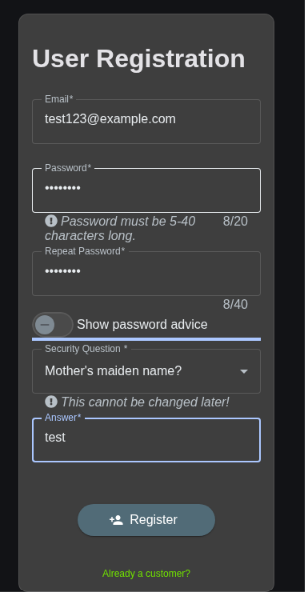


Перед натисканням кнопки **Register** у Burp Suite було ввімкнено перехоплення запитів:

```text
Proxy → Intercept → Intercept is on
```

У результаті було перехоплено POST-запит до API реєстрації:

```http
POST /api/Users/ HTTP/1.1
Host: localhost:3000
Content-Type: application/json
```

Початкове тіло запиту містило заповнені значення:

```json
{
  "email": "test123@example.com",
  "password": "Test123!",
  "passwordRepeat": "Test123!",
  "securityQuestion": {
    "id": 2,
    "question": "Mother's maiden name?"
  },
  "securityAnswer": "test"
}
```

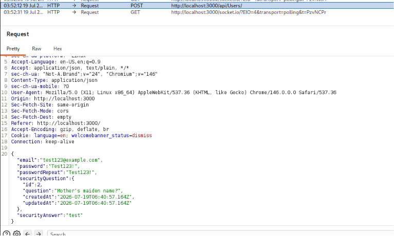


У перехопленому запиті значення полів `email`, `password` і `passwordRepeat` було замінено на порожні рядки:

```json
{
  "email": "",
  "password": "",
  "passwordRepeat": "",
  "securityQuestion": {
    "id": 1,
    "question": "..."
  },
  "securityAnswer": "test"
}
```

Після зміни тіла запиту його було передано серверу за допомогою кнопки **Forward**.

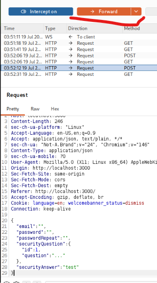


Сервер прийняв змінений запит, незважаючи на те, що обов’язкові поля не містили даних. Після цього OWASP Juice Shop відобразив повідомлення:

```text
You successfully solved a challenge: Empty User Registration
```

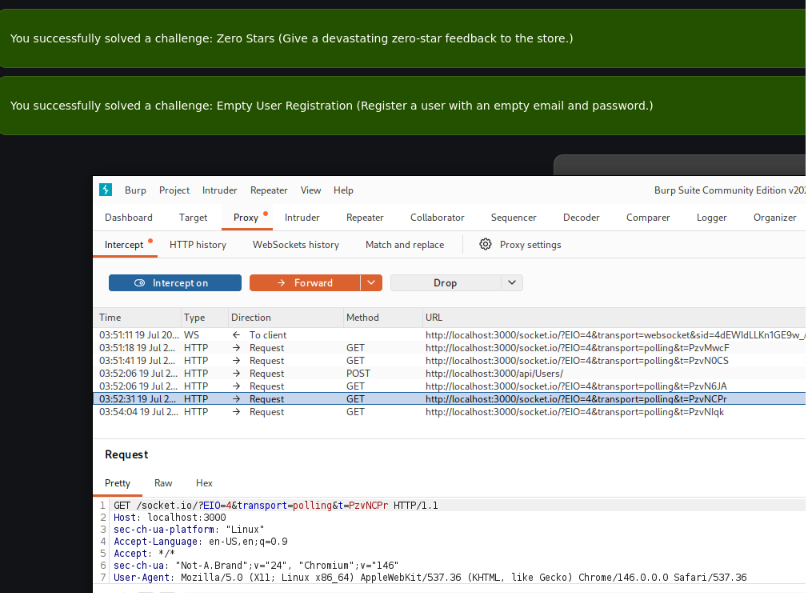


Отриманий результат демонструє, що клієнтська перевірка обов’язкових полів не є достатнім механізмом захисту. Користувач може обійти обмеження інтерфейсу та змінити HTTP-запит перед його надсиланням.

Для запобігання такій вразливості сервер повинен самостійно перевіряти наявність і формат адреси електронної пошти, мінімальну довжину пароля та відповідність повторно введеного пароля незалежно від стану клієнтської форми.

### 11. Обхід CAPTCHA за допомогою автоматизованого надсилання запитів

На наступному етапі було виконано завдання **CAPTCHA Bypass**, метою якого було надіслати щонайменше 10 відгуків протягом 20 секунд, повторно використовуючи одну й ту саму правильну відповідь CAPTCHA.

Спочатку у формі **Customer Feedback** було введено довільний коментар, установлено рейтинг `1` і розв’язано CAPTCHA:

```text
6 × 5 + 6 = 36
```

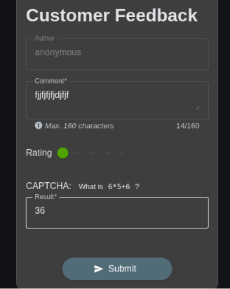


Перед натисканням кнопки **Submit** у Burp Suite було ввімкнено перехоплення HTTP-запитів. У результаті було отримано POST-запит до кінцевої точки:

```http
POST /api/Feedbacks/ HTTP/1.1
Host: localhost:3000
Content-Type: application/json
```

У тілі запиту передавалися такі дані:

```json
{
  "captchaId": 3,
  "captcha": "36",
  "comment": "fjjfjfjfdjfjf (anonymous)",
  "rating": 1
}
```

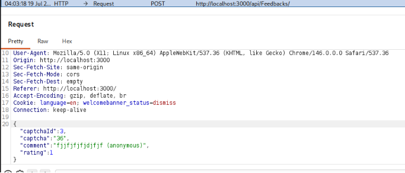


Перехоплений запит було передано до інструмента **Intruder**. Щоб кожен відгук дещо відрізнявся, у полі `comment` було створено позицію для числового корисного навантаження:

```json
{
  "captchaId": 3,
  "captcha": "36",
  "comment": "feedback-§1§",
  "rating": 1
}
```

У налаштуваннях **Payloads** було обрано тип `Numbers` і задано послідовний діапазон:

```text
From: 1
To: 20
Step: 1
```

Після запуску атаки Burp Suite автоматично надіслав серію HTTP-запитів. У кожному запиті змінювався лише номер у коментарі, тоді як значення `captchaId` і правильна відповідь `36` залишалися незмінними.

Таким чином, одна й та сама CAPTCHA була повторно використана для надсилання багатьох відгуків протягом короткого проміжку часу.

Після завершення автоматизованого надсилання OWASP Juice Shop відобразив повідомлення:

```text
You successfully solved a challenge: CAPTCHA Bypass
(Submit 10 or more customer feedbacks within 20 seconds.)
```

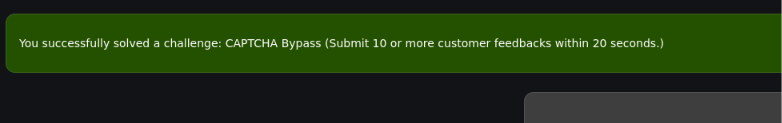


Отриманий результат демонструє, що CAPTCHA не забезпечувала належного захисту від повторного використання. Сервер приймав одну й ту саму відповідь багато разів і не обмежував швидкість надсилання відгуків.

Для запобігання такій вразливості CAPTCHA повинна бути одноразовою, мати короткий строк дії та ставати недійсною одразу після успішного використання. Додатково серверу необхідно застосовувати обмеження частоти запитів, затримки між спробами та контроль кількості операцій з однієї сесії або IP-адреси.