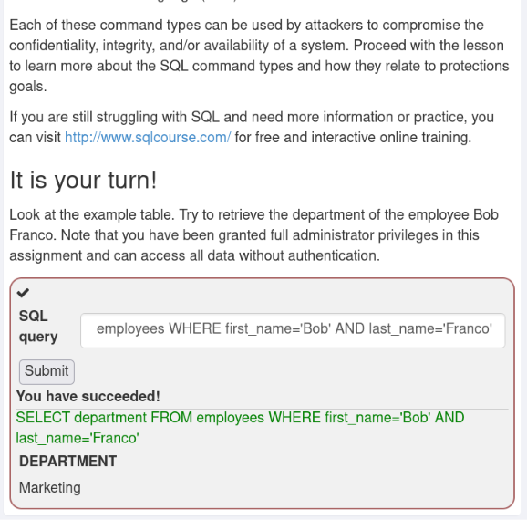
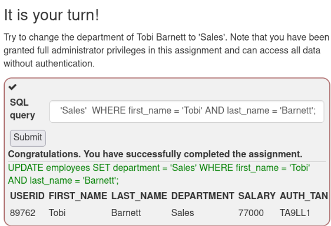
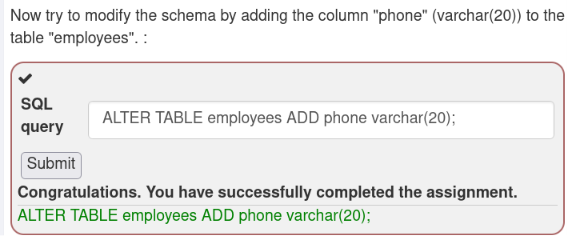
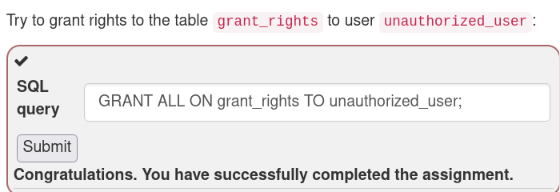
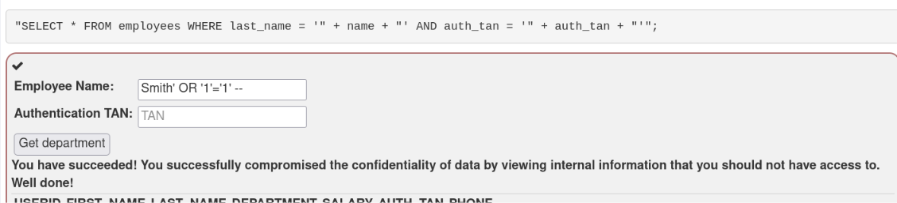
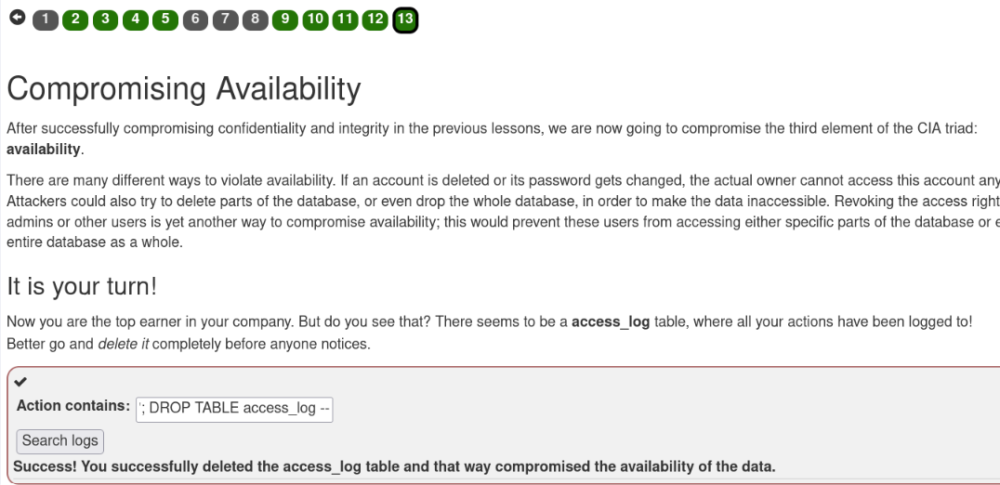

# Виконання завдання OWASP WebGoat «SQL Injection (Intro)»

## Мета роботи

Дослідити принципи роботи мови структурованих запитів SQL, розглянути основні категорії SQL-команд та практично продемонструвати можливість порушення конфіденційності й доступності даних унаслідок використання SQL-ін’єкцій у навчальному середовищі OWASP WebGoat.

## Використане програмне забезпечення

- Kali Linux;
- Docker;
- OWASP WebGoat;
- Burp Suite Community Edition;
- браузер Chromium;
- Visual Studio Code.

> Усі дії виконувалися виключно в локальному навчальному середовищі OWASP WebGoat.

## Теоретичні відомості

### Поняття SQL

**SQL** (*Structured Query Language*) — це мова структурованих запитів, призначена для створення, перегляду, зміни та керування даними в реляційних базах даних.

У реляційній базі дані організовуються у вигляді таблиць. Таблиця складається зі стовпців, що визначають властивості об’єктів, і рядків, кожен із яких містить окремий запис.

Наприклад, таблиця `employees` може містити такі поля:

| Поле | Призначення |
| :--- | :--- |
| `userid` | унікальний ідентифікатор працівника |
| `first_name` | ім’я працівника |
| `last_name` | прізвище працівника |
| `department` | назва відділу |
| `salary` | заробітна плата |
| `auth_tan` | номер автентифікації транзакції |

SQL-запити дають змогу отримувати записи з таблиць, додавати нові дані, змінювати наявні значення, видаляти записи та керувати структурою бази даних.

### Основні категорії SQL-команд

SQL-команди поділяються на три основні категорії:

1. **DML** (*Data Manipulation Language*) — мова маніпулювання даними;
2. **DDL** (*Data Definition Language*) — мова визначення даних;
3. **DCL** (*Data Control Language*) — мова керування даними.

#### Data Manipulation Language

Команди DML використовуються для роботи з даними, які зберігаються в таблицях:

- `SELECT` — отримання даних;
- `INSERT` — додавання нових записів;
- `UPDATE` — зміна наявних записів;
- `DELETE` — видалення записів.

Приклад отримання інформації про працівника:

```sql
SELECT department
FROM employees
WHERE first_name = 'Bob'
  AND last_name = 'Franco';
```

#### Data Definition Language

Команди DDL призначені для створення та зміни структури об’єктів бази даних:

- `CREATE` — створення нового об’єкта;
- `ALTER` — зміна структури наявного об’єкта;
- `DROP` — видалення об’єкта бази даних.

Приклад додавання нового стовпця до таблиці:

```sql
ALTER TABLE employees
ADD phone varchar(20);
```

#### Data Control Language

Команди DCL використовуються для керування правами доступу користувачів до об’єктів бази даних:

- `GRANT` — надання прав;
- `REVOKE` — відкликання прав.

Приклад надання користувачу повного доступу до таблиці:

```sql
GRANT ALL
ON grant_rights
TO unauthorized_user;
```

### Поняття SQL-ін’єкції

**SQL-ін’єкція** — це вразливість, яка виникає, коли введені користувачем дані без належної перевірки або параметризації додаються до SQL-запиту.

Наприклад, вебзастосунок може формувати запит шляхом об’єднання SQL-коду з введеним значенням:

```text
SELECT * FROM employees
WHERE last_name = 'введене_користувачем_значення';
```

Якщо введення не перевіряється, користувач може додати SQL-оператори та змінити початкову логіку запиту. Для цього можуть використовуватися спеціальні конструкції:

- `'` — завершення рядкового значення;
- `OR 1=1` — створення умови, яка завжди є істинною;
- `;` — завершення одного запиту та початок іншого;
- `--` — коментування залишку SQL-запиту.

Приклад умови, яка завжди повертає істинне значення:

```sql
' OR '1'='1' --
```

### Вплив SQL-ін’єкції на тріаду CIA

Успішна SQL-ін’єкція може порушити основні властивості інформаційної безпеки:

- **конфіденційність** — отримання доступу до закритої інформації;
- **цілісність** — несанкціонована зміна даних;
- **доступність** — видалення даних або об’єктів бази даних.

Наприклад, команда `SELECT` може бути використана для отримання конфіденційних записів, `UPDATE` — для несанкціонованої зміни інформації, а `DROP` — для повного видалення таблиці.

## Хід виконання роботи
### 1. Отримання даних за допомогою оператора SELECT

На першому практичному етапі необхідно було визначити назву відділу, у якому працює співробітник **Bob Franco**.

Для отримання даних із таблиці використовується оператор `SELECT`, який належить до категорії **DML** (*Data Manipulation Language*). Умова `WHERE` дає змогу вибрати лише той запис, який відповідає заданим параметрам.

Для виконання завдання було сформовано SQL-запит:

```sql
SELECT department
FROM employees
WHERE first_name = 'Bob'
  AND last_name = 'Franco';
```

У цьому запиті:

- `SELECT department` визначає стовпець, значення якого потрібно отримати;
- `FROM employees` указує таблицю, у якій виконується пошук;
- `WHERE` задає умови вибору запису;
- оператор `AND` вимагає одночасного виконання обох умов.

Після виконання запиту WebGoat повернув значення:

```text
Marketing
```

Отже, співробітник **Bob Franco** працює у відділі **Marketing**.



### 2. Зміна даних за допомогою оператора UPDATE

На другому практичному етапі необхідно було змінити назву відділу співробітника **Tobi Barnett** на `Sales`.

Для зміни наявних даних у таблиці використовується оператор `UPDATE`, який належить до категорії **DML** (*Data Manipulation Language*). За допомогою конструкції `SET` задається нове значення поля, а умова `WHERE` визначає запис, який потрібно оновити.

Для виконання завдання було сформовано SQL-запит:

```sql
UPDATE employees
SET department = 'Sales'
WHERE first_name = 'Tobi'
  AND last_name = 'Barnett';
```

У цьому запиті:

- `UPDATE employees` визначає таблицю, дані якої потрібно змінити;
- `SET department = 'Sales'` установлює нове значення поля `department`;
- `WHERE` обмежує виконання операції записом конкретного працівника;
- оператор `AND` перевіряє одночасний збіг імені та прізвища.

Використання умови `WHERE` є обов’язковим, оскільки без неї значення поля `department` було б змінено для всіх записів таблиці.

Після виконання запиту WebGoat відобразив оновлені дані співробітника:

```text
USERID: 89762
FIRST_NAME: Tobi
LAST_NAME: Barnett
DEPARTMENT: Sales
SALARY: 77000
AUTH_TAN: TA9LL1
```

Отже, назву відділу співробітника **Tobi Barnett** було успішно змінено з попереднього значення на `Sales`.



### 3. Зміна структури таблиці за допомогою ALTER TABLE

На третьому практичному етапі необхідно було змінити структуру таблиці `employees`, додавши до неї новий стовпець `phone` для зберігання телефонних номерів працівників.

Для зміни структури наявних об’єктів бази даних використовуються команди **DDL** (*Data Definition Language*). Оператор `ALTER TABLE` дає змогу додавати, змінювати або видаляти стовпці таблиці без необхідності створювати її заново.

Для виконання завдання було сформовано SQL-запит:

```sql
ALTER TABLE employees
ADD phone varchar(20);
```

У цьому запиті:

- `ALTER TABLE employees` визначає таблицю, структуру якої потрібно змінити;
- `ADD` указує на необхідність додавання нового стовпця;
- `phone` є назвою нового поля;
- `varchar(20)` визначає текстовий тип даних із максимальною довжиною до 20 символів.

Після виконання запиту WebGoat відобразив повідомлення про успішне завершення завдання:

```text
Congratulations. You have successfully completed the assignment.
```

У результаті до структури таблиці `employees` було додано новий стовпець:

```text
phone varchar(20)
```




Виконання цього завдання демонструє, що команди DDL впливають не на окремі записи, а на структуру самої бази даних. У разі успішної SQL-ін’єкції несанкціоноване виконання таких команд може призвести до зміни або видалення таблиць та інших об’єктів бази даних.

### 4. Надання прав доступу за допомогою оператора GRANT

На четвертому практичному етапі необхідно було надати користувачеві `unauthorized_user` повні права доступу до таблиці `grant_rights`.

Для керування правами доступу до об’єктів бази даних використовуються команди **DCL** (*Data Control Language*). Оператор `GRANT` дає змогу надавати користувачам певні привілеї, наприклад право переглядати, додавати, змінювати або видаляти дані.

Для виконання завдання було сформовано SQL-запит:

```sql
GRANT ALL
ON grant_rights
TO unauthorized_user;
```

У цьому запиті:

- `GRANT ALL` указує на надання всіх доступних привілеїв;
- `ON grant_rights` визначає таблицю, до якої надаються права;
- `TO unauthorized_user` указує користувача, якому призначаються ці права.

Після виконання запиту WebGoat відобразив повідомлення:

```text
Congratulations. You have successfully completed the assignment.
```

Отже, користувачеві `unauthorized_user` було успішно надано повні права доступу до таблиці `grant_rights`.




Виконання цього завдання демонструє небезпеку несанкціонованого використання команд DCL. Якщо зловмисник отримає можливість виконувати оператор `GRANT`, він може надати собі або іншому обліковому запису розширені права доступу до конфіденційних даних чи адміністративних функцій бази даних.

### 5. Порушення конфіденційності за допомогою рядкової SQL-ін’єкції

На п’ятому практичному етапі необхідно було продемонструвати порушення конфіденційності даних за допомогою рядкової SQL-ін’єкції. Метою завдання було отримати інформацію не лише про користувача **John Smith**, а й про інших працівників компанії.

Вебзастосунок формував SQL-запит шляхом безпосереднього об’єднання введених користувачем значень:

```sql
SELECT *
FROM employees
WHERE last_name = 'введене_прізвище'
  AND auth_tan = 'введений_TAN';
```

Такий спосіб формування запиту є небезпечним, оскільки введені дані не проходять належної перевірки та можуть бути інтерпретовані як частина SQL-коду.

У поле **Employee Name** було введено:

```sql
Smith' OR '1'='1' --
```

Поле **Authentication TAN** не мало значення для результату, оскільки відповідна частина початкового запиту була закоментована.

Після підстановки введеного значення сформований запит набув приблизно такого вигляду:

```sql
SELECT *
FROM employees
WHERE last_name = 'Smith'
   OR '1'='1' --'
  AND auth_tan = 'TAN';
```

У цій конструкції:

- символ `'` завершує початкове рядкове значення;
- оператор `OR` додає альтернативну умову;
- вираз `'1'='1'` завжди повертає істинне значення;
- послідовність `--` перетворює залишок початкового SQL-запиту на коментар.

Унаслідок цього умова `WHERE` стала істинною для всіх записів таблиці, а перевірка номера автентифікації `auth_tan` фактично не виконувалася.

Після надсилання запиту WebGoat відобразив повідомлення:

```text
You have succeeded! You successfully compromised the confidentiality
of data by viewing internal information that you should not have access to.
```

Також було отримано доступ до даних працівників, зокрема їхніх ідентифікаторів, імен, прізвищ, відділів, заробітних плат та номерів автентифікації.




Отриманий результат демонструє порушення конфіденційності, оскільки користувач отримав доступ до інформації, яку не повинен був переглядати. Основною причиною вразливості стало формування SQL-запиту шляхом конкатенації рядків замість використання параметризованих запитів.

### 6. Порушення доступності за допомогою команди DROP TABLE

На шостому практичному етапі необхідно було продемонструвати порушення доступності даних. У системі існувала таблиця `access_log`, у якій зберігалися записи про виконані користувачами дії.

Для видалення цієї таблиці було використано техніку ланцюжка SQL-запитів. Вона полягає в завершенні початкового запиту за допомогою символу `;` та додаванні власної SQL-команди.

У поле **Action contains** було введено:

```sql
'; DROP TABLE access_log --
```

Після підстановки цього значення вебзастосунок виконав додаткову команду:

```sql
DROP TABLE access_log;
```

У використаній конструкції:

- символ `'` завершує початкове рядкове значення;
- символ `;` завершує початковий SQL-запит;
- команда `DROP TABLE access_log` повністю видаляє таблицю журналу;
- послідовність `--` коментує залишок початкового запиту та запобігає виникненню синтаксичної помилки.

Команда `DROP` належить до категорії **DDL** (*Data Definition Language*) та використовується для видалення об’єктів бази даних. На відміну від оператора `DELETE`, який видаляє окремі записи, `DROP TABLE` видаляє всю таблицю разом із її структурою та вмістом.

Після виконання запиту WebGoat відобразив повідомлення:

```text
Success! You successfully deleted the access_log table
and that way compromised the availability of the data.
```




У результаті таблиця `access_log` стала недоступною, а інформація про дії користувачів більше не могла бути переглянута. Це демонструє порушення доступності, оскільки дані та сам об’єкт бази даних перестали існувати для легітимних користувачів і адміністраторів.

Основною причиною вразливості стало те, що вебзастосунок дозволяв користувацькому введенню змінювати структуру SQL-запиту та виконувати додаткові команди. Для запобігання подібним атакам необхідно використовувати параметризовані запити, обмежувати права облікового запису бази даних і забороняти виконання декількох SQL-команд в одному запиті.